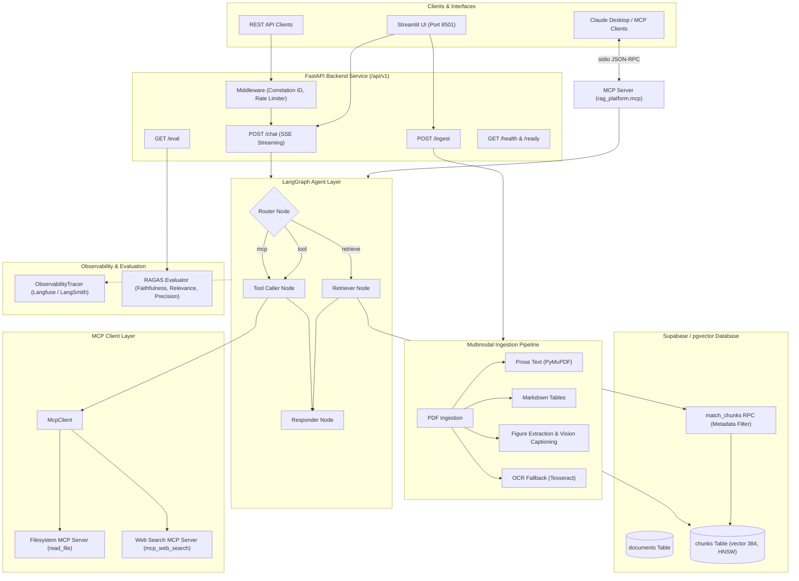

# Multimodal Agentic RAG Platform with MCP

[](https://github.com/mubashir-yaseen/RAG_chatbot/actions/workflows/ci.yml)
[](https://github.com/mubashir-yaseen/RAG_chatbot)
[](https://www.python.org/)
[](https://fastapi.tiangolo.com)
[](https://langchain-ai.github.io/langgraph/)
[](https://opensource.org/licenses/MIT)

A production-grade, multimodal, agentic **Retrieval-Augmented Generation (RAG)** platform featuring **Model Context Protocol (MCP)** server & client interoperability, **Supabase pgvector** multi-document search with metadata filtering, **RAGAS** automated evaluation, **Langfuse** distributed tracing, and an asynchronous **FastAPI** backend deployable via Docker & GitHub Actions CI/CD.

---

## Why This Project?

Most RAG repositories stop at basic text chunking from a single PDF and calling an LLM in a script. This platform represents a production-style, principal-engineer-grade architecture addressing real-world LLM engineering challenges:

1. **Multimodal Ingestion**: Real PDFs contain tables, scanned pages, and figures. The ingestion pipeline extracts Markdown tables to preserve relational data, executes Vision LLM captioning for embedded diagrams, and triggers automated OCR fallback when pages lack digital text.
2. **Multi-Document Knowledge Base**: Persistent vector search via Supabase and PostgreSQL `pgvector` with HNSW indexing, multi-attribute filtering (document ID, content type, date ranges), and exponential backoff retry for transient network drops.
3. **Agentic Routing with LangGraph**: Rather than forcing every question through vector search, a state graph router classifies user intent into direct answers, document retrieval, sandboxed AST math calculation, live web search, or hybrid multi-step execution.
4. **Bidirectional MCP Interoperability**: Operates both as an **MCP Server** (exposing knowledge base search to Claude Desktop and Cursor) and an **MCP Client** (dynamically consuming external tools like filesystem readers and web search servers).
5. **Evaluation & Observability**: Quantitative RAGAS scoring (Faithfulness, Answer Relevance, Context Precision) against labeled benchmarks combined with Langfuse/LangSmith distributed trace spans and structured JSON correlation logging.
6. **Production Backend & CI/CD**: Clean `src/` layout, versioned REST API with Server-Sent Events (SSE) streaming, IP rate-limiting, centralized exception hierarchy, multi-stage Docker builds, and automated GitHub Actions test pipelines.

---

## Visual Architecture



---

## Repository Structure

```
rag-platform/
├── src/
│   └── rag_platform/
│       ├── __init__.py             # Unified package exports & version
│       ├── config.py               # pydantic-settings, zero hardcoded secrets
│       ├── logging_config.py       # Structured JSON logging & correlation IDs
│       ├── exceptions.py           # Domain exception hierarchy (RagPlatformError)
│       ├── rag_system.py           # Core RAG engine & embedding generation
│       ├── ingestion/              # Multimodal extraction pipeline
│       │   ├── models.py           # Typed Pydantic schemas (ExtractedChunk, IngestionResult)
│       │   ├── pdf_text.py         # Prose text chunking & page splitting
│       │   ├── tables.py           # High-accuracy table extraction & markdown conversion
│       │   ├── images.py           # Figure extraction & Vision LLM captioning
│       │   ├── ocr.py              # OCR fallback for scanned/image-only PDFs
│       │   └── pipeline.py         # Unified multimodal ingestion coordinator
│       ├── vectorstore/            # Supabase / pgvector multi-document store
│       │   ├── models.py           # DocumentRecord, SearchFilter, SearchResult
│       │   ├── supabase_store.py   # Persistent pgvector store with retry & metadata filtering
│       │   └── migrations/         # Versioned SQL migrations (documents, chunks, match_chunks RPC)
│       ├── agent/                  # LangGraph agent router & tools
│       │   ├── graph.py            # StateGraph agent definition & run_agent runner
│       │   ├── tools.py            # Retrieval, safe calculator, and web search tools
│       │   └── mcp_client.py       # MCP client layer consuming external MCP servers
│       ├── mcp/                    # Model Context Protocol server implementation
│       │   └── server.py           # FastMCP stdio server exposing RAG tools
│       ├── eval/                   # RAGAS evaluation harness & testsets
│       │   ├── run_eval.py         # Faithfulness, relevance, precision evaluator
│       │   └── testset.json        # Ground-truth multi-document testset (12 samples)
│       ├── api/                    # Production FastAPI backend (async, SSE)
│       │   ├── main.py             # Application factory & server entrypoint
│       │   ├── schemas.py          # Request/response validation models
│       │   ├── middleware.py       # Correlation ID & rate-limiting middleware
│       │   └── routes/             # Versioned endpoints (/api/v1/chat, /ingest, /eval)
│       └── observability/          # Tracing & telemetry
│           └── tracing.py          # Langfuse / LangSmith distributed tracing
├── ui/
│   └── app.py                      # Multi-document Streamlit UI client
├── docker/
│   ├── Dockerfile                  # Multi-stage FastAPI backend container
│   ├── Dockerfile.ui               # Multi-stage Streamlit UI container
│   └── docker-compose.yml          # Local multi-service orchestration
├── .github/
│   └── workflows/
│       └── ci.yml                  # GitHub Actions CI (lint, typecheck, test, docker build)
├── tests/
│   ├── unit/                       # 79 fast isolated unit tests
│   └── integration/                # Service & database integration tests
├── mcp_config.json                 # External MCP server registry configuration
├── pyproject.toml                  # Unified dependencies, ruff, mypy, and pytest config
├── .pre-commit-config.yaml         # Automated pre-commit lint and typing checks
├── .env.example                    # Environment variable template
├── CONTRIBUTING.md                 # Developer setup and contribution guidelines
└── CHANGELOG.md                    # Keep a Changelog format across all 10 phases
```

---

## Core Feature Breakdown

### 1. Multimodal Ingestion Pipeline
Converts diverse unstructured PDF documents into typed, structured chunks:
- **Prose Text**: Page-aware extraction with overlap chunking via `RecursiveCharacterTextSplitter`.
- **Tabular Data**: Detects table borders and cells, converts them into standard Markdown tables (`content_type=ContentType.TABLE`) to preserve relational context.
- **Figures & Images**: Extracts embedded figures, persists high-resolution assets to disk, and generates rich semantic captions using Vision LLMs.
- **Scanned Document OCR**: Automatically triggers OCR fallback when digital text is absent from a page.

### 2. Multi-Document Knowledge Base on Supabase
Replaces single-session ephemeral stores with persistent, production-grade pgvector storage:
- **Relational Document Tracking**: `documents` table tracking file metadata, upload timestamps, and page metrics.
- **Vector Indexing & Storage**: `chunks` table with `vector(384)` embeddings and JSONB metadata, indexed with HNSW for sub-millisecond approximate nearest neighbor retrieval.
- **Multi-Attribute Metadata Filtering**: Query across all uploaded documents or scope searches to a specific document ID, content type (`text`, `table`, `image`), and date ranges via the `match_chunks` PostgreSQL RPC function.
- **Resilient Retry Logic**: Exponential backoff wrapper `with_retry()` mitigating transient connection drops.

### 3. LangGraph Agent Layer
Dynamic multi-node agent orchestration powered by LangGraph:
- **Router Node**: Dynamically classifies user intent (`retrieve`, `tool`, `mcp`, `hybrid`, `direct`) using LLM function calling and AST pattern matching.
- **Retriever Node**: Executes vector search with active metadata filters against the multi-document knowledge base.
- **Tool Caller Node**: Executes external tools such as the sandboxed AST `calculator_tool()`, `web_search_tool()`, and external MCP client tools.
- **Responder Node**: Synthesizes retrieved chunks and tool outputs into a grounded final answer with complete source citations.

### 4. Model Context Protocol (MCP) Server
Exposes the RAG platform as an open MCP server, allowing external MCP clients (Claude Desktop, Claude Code, Cursor) to directly query the knowledge base and list documents.

#### Exposed MCP Tools:
1. `query_knowledge_base`: Search across multimodal chunks (text, tables, images) and synthesize cited answers.
2. `list_documents`: Returns all indexed documents with page and table metadata.

### 5. MCP Client: External Server Consumption
The agent consumes external MCP servers defined in `mcp_config.json`:
- **Filesystem Server (`read_file`)**: Inspects and reads local files on demand.
- **Web Search Server (`mcp_web_search`)**: Queries live web data when internal retrieval is insufficient.

### 6. Evaluation & Observability
- **Observability Tracing (`rag_platform.observability`)**: Captures router decisions, retriever chunks, tool call execution details, token counts, and latency metrics with native export support for **Langfuse** and **LangSmith**.
- **RAGAS Evaluation Harness (`rag_platform.eval`)**: Computes Faithfulness, Answer Relevance, and Context Precision over labeled ground-truth benchmarks in `testset.json`.

### 7. Production FastAPI Backend (`/api/v1`)
High-performance asynchronous REST API:
- `POST /api/v1/chat`: Multi-document chat with optional Server-Sent Events (`stream=true`).
- `POST /api/v1/ingest`: Multimodal PDF file ingestion endpoint.
- `GET /api/v1/eval`: On-demand RAGAS benchmark execution.
- `GET /api/v1/health` & `GET /api/v1/ready`: Health and dependency readiness probes.

---

## Claude Desktop Setup (MCP Server)

Register the server in your Claude Desktop configuration:

- **macOS**: `~/Library/Application Support/Claude/claude_desktop_config.json`
- **Windows**: `%APPDATA%\Claude\claude_desktop_config.json`

```json
{
  "mcpServers": {
    "rag-knowledge-base": {
      "command": "python",
      "args": [
        "-m",
        "rag_platform.mcp.server"
      ],
      "env": {
        "SUPABASE_URL": "https://your-project.supabase.co",
        "SUPABASE_SERVICE_ROLE_KEY": "your-supabase-key",
        "OPENROUTER_API_KEY": "your-openrouter-key",
        "EMBEDDING_MODEL": "sentence-transformers/all-MiniLM-L6-v2"
      }
    }
  }
}
```

---

## Setup & Installation

### 1. Clone & Set Up Virtual Environment

```bash
# Clone the repository
git clone https://github.com/mubashir-yaseen/RAG_chatbot.git
cd RAG_chatbot

# Create virtual environment
python -m venv venv

# Activate environment
# Windows:
venv\Scripts\activate
# Linux/macOS:
source venv/bin/activate

# Install dependencies in editable mode
pip install --upgrade pip setuptools wheel
pip install -e ".[dev]"
```

### 2. Configure Database & Environment Variables

1. Apply the SQL migration in your Supabase SQL Editor:
   `src/rag_platform/vectorstore/migrations/001_create_documents_and_chunks.sql`

2. Copy the example environment template:
   ```bash
   cp .env.example .env
   ```

Key variables in `.env`:
- `SUPABASE_URL` & `SUPABASE_SERVICE_ROLE_KEY` (or `SUPABASE_ANON_KEY`)
- `OPENROUTER_API_KEY` (or `OPENAI_API_KEY`)
- `LLM_MODEL` (e.g. `nvidia/nemotron-3-ultra-550b-a55b:free`, `openai/gpt-4o-mini`)
- `EMBEDDING_MODEL` (e.g. `sentence-transformers/all-MiniLM-L6-v2`)
- `LANGFUSE_PUBLIC_KEY` & `LANGFUSE_SECRET_KEY` (optional)

---

## Running the Application

### Option 1: Docker Compose (Recommended)

```bash
# Start API & UI services in background
docker-compose up -d --build

# View container logs
docker-compose logs -f
```
- **FastAPI Backend**: `http://localhost:8000` (OpenAPI docs at `http://localhost:8000/docs`)
- **Streamlit Web UI**: `http://localhost:8501`

### Option 2: Local Python Services

#### Start FastAPI Backend Server
```bash
python -m uvicorn rag_platform.api.main:app --host 0.0.0.0 --port 8000 --reload
```

#### Start Streamlit Web UI
```bash
streamlit run ui/app.py
```

#### Run RAGAS Evaluation Benchmark CLI
```bash
python -m rag_platform.eval.run_eval --limit 10 --output eval_report.json
```

---

## Testing & Quality Control

```bash
# Run all unit tests
python -m pytest -v tests/unit/

# Run with test coverage
python -m pytest -v --cov=src/rag_platform --cov-report=term-missing tests/unit/

# Check linting and formatting
ruff check .
ruff format --check .

# Run static type checking
mypy src
```

---

## Contributing

Please review [CONTRIBUTING.md](CONTRIBUTING.md) for detailed guidelines on coding standards, pre-commit hooks, and pull request workflows.

---

## Changelog

See [CHANGELOG.md](CHANGELOG.md) for a comprehensive record of changes across all 10 developmental phases.

---

## License

This project is licensed under the terms of the [MIT License](LICENSE).
